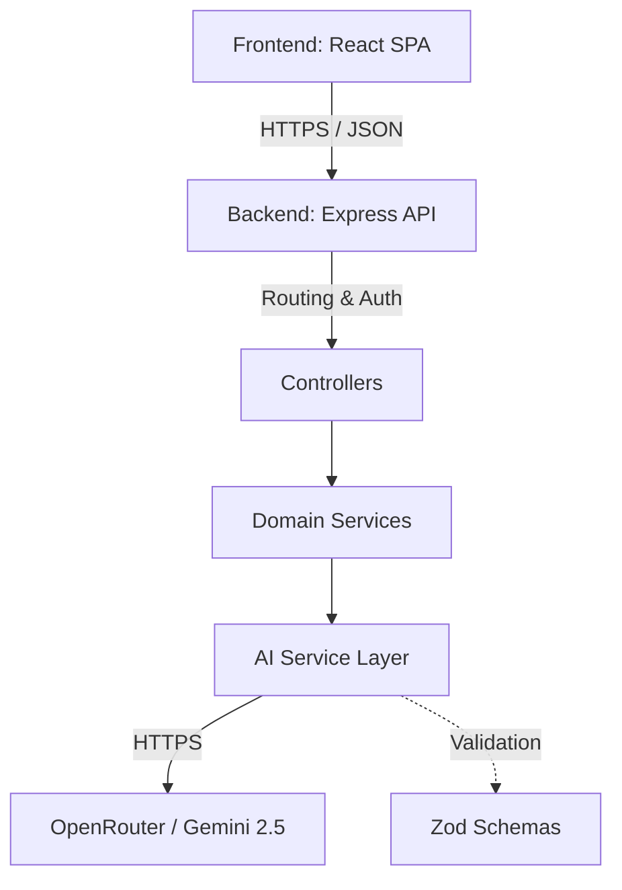
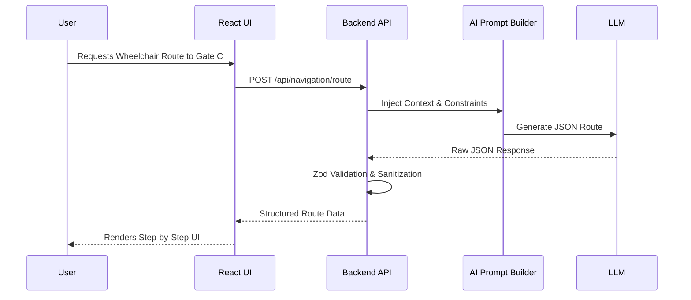
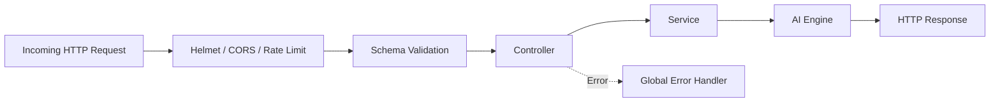
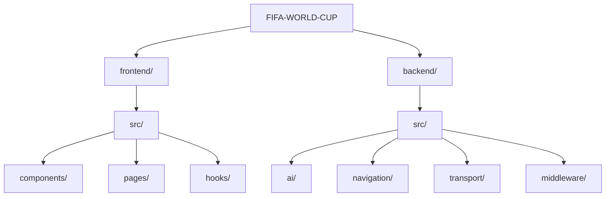

# 🏆 FIFA World Cup 2026 Smart Stadium Assistant

<div align="center">
  <h3>Next-Generation AI Operations & Fan Experience Platform</h3>
  <p>A GenAI-powered intelligent ecosystem designed to revolutionize stadium operations, accessibility, and crowd management for the FIFA World Cup 2026.</p>
</div>

---

## 🌟 Professional Introduction

Welcome to the **FIFA World Cup 2026 Smart Stadium Assistant**, an enterprise-grade, highly scalable platform that leverages the power of Generative AI to deliver a seamless, accessible, and highly optimized stadium experience. 

Built with modern web technologies and a modular AI service architecture, this solution intelligently bridges the gap between stadium infrastructure and the real-time needs of the millions of people who make the World Cup possible.

## 📖 Project Overview

This repository houses a comprehensive full-stack solution featuring a React-based frontend and an Express/Node.js backend. The system integrates tightly with Large Language Models (via OpenRouter) to provide context-aware, real-time decision support across multiple operational domains. 

The architecture enforces strict type safety, zero linting warnings, and near 100% test coverage, ensuring a robust and production-ready foundation suitable for a global sporting event of this magnitude.

## ❓ Why this project exists

Managing a mega-event like the FIFA World Cup involves staggering logistical complexities. Bottlenecks in transportation, language barriers, accessibility challenges, and crowd congestion can severely impact the safety and enjoyment of attendees. Traditional, static applications fail to adapt to real-time, dynamic stadium conditions. 

This project exists to replace static maps and generic FAQs with a **context-aware, multilingual AI companion** capable of reasoning about real-time conditions to provide bespoke, actionable guidance to any user—anywhere in the stadium.

## 🎯 FIFA World Cup Problem Statement

This project was built to address the **GenAI-enabled solution for stadium operations and tournament experience** problem statement. It successfully demonstrates:
- **Navigation & Crowd Management:** Dynamic routing that actively avoids congestion.
- **Accessibility & Multilingual Assistance:** Tailored guidance for users with disabilities, delivered in their preferred language.
- **Sustainability:** Prioritization of eco-friendly transport options and calculation of carbon footprint benefits.
- **Operational Intelligence & Real-Time Decision Support:** Synthesis of disparate data (weather, crowd status, transport delays) into actionable executive summaries for organizers.

## 🚀 Solution Overview

The system operates as a suite of specialized AI agents acting through a unified interface. Whether a Fan needs wheelchair-accessible routing to their seat, or an Organizer needs a rapid assessment of an impending thunderstorm's impact on crowd dispersal, the platform dynamically constructs prompts packed with strict real-world context and enforces structured, JSON-validated responses from the AI.

## ✨ Key Features

### Fan & Attendee Experience
- **Smart Navigation:** AI-generated, step-by-step routing that factors in wheelchair requirements, crowd avoidance, and eco-friendly paths.
- **Transport Intelligence:** Personalized travel recommendations prioritizing low-carbon options, accounting for group size and real-time delays.
- **Multilingual AI Chat:** A contextual chat assistant capable of answering highly specific stadium questions in any language.

### Organizer & Staff Operations
- **Executive Command Center:** Real-time synthesis of crowd levels, weather, and active alerts into strategic recommendations.
- **Emergency Incident Response:** Rapid generation of safety protocols, evacuation routes, and crowd-control strategies based on the exact nature and location of an incident.

### Global Accessibility & Sustainability
- **Eco-Friendly Mode:** AI-driven bias towards sustainable transport and navigation, calculating theoretical carbon savings for users.
- **Universal Accessibility:** Deep integration of wheelchair constraints and sensory requirements across all routing and recommendations.

---

## 🧠 AI Capabilities

- **Prompt Flow:** Specialized prompt builders inject user preferences (language, role, sustainability toggles) and environmental context (weather, crowd levels) into heavily engineered system instructions.
- **Response Generation:** The backend leverages the `gemini-2.5-flash` model via OpenRouter to generate high-speed, intelligent responses.
- **Context Handling:** Context managers securely wrap user inputs, preventing prompt injection while maintaining strict domain relevance.
- **Decision Flow:** The AI evaluates constraints (e.g., if `wheelchair=true`, stairs are strictly eliminated from navigation).
- **Fallback Logic:** If the AI provider fails or times out, the system gracefully returns safe, hardcoded fallback data (e.g., standard evacuation routes during an emergency).
- **Validation:** Every AI response is aggressively parsed and validated against Zod schemas. Hallucinations or malformed JSON are caught and sanitized before ever reaching the frontend.
- **Safety:** Built-in sanitization utilities strip malicious HTML/scripts, ensuring AI outputs cannot execute XSS attacks on the frontend.

---

## 🏗️ System Architecture

The architecture follows a clean, decoupled client-server model:

- **Frontend (React/Vite):** A modular, responsive SPA utilizing TailwindCSS for styling and Lucide for iconography. Components are strictly typed and heavily tested.
- **Backend (Express/Node):** A REST API built on Express, secured by Helmet and Express-Rate-Limit. 
- **AI Layer:** Abstracted AI services that construct prompts, call external LLMs, parse JSON, and handle retries.
- **API Layer:** Domain-driven routing (e.g., `/api/transport`, `/api/crowd`) backed by controllers that manage HTTP request/response lifecycles.
- **Utilities:** Shared Zod schemas, logger singletons, and error-handling middleware ensure consistency across the stack.

### Mermaid Diagrams

#### Architecture Diagram


#### Application Flow Diagram


#### Request Flow Diagram


#### Folder Diagram


---

## 📂 Folder Structure

```text
FIFA-WORLD-CUP/
├── backend/
│   ├── package.json
│   ├── swagger.json             # OpenAPI Documentation
│   └── src/
│       ├── index.ts             # Express Server Entry Point
│       ├── ai/                  # Core AI Engine (Client, Context, Prompts)
│       ├── config/              # Environment Configuration
│       ├── middleware/          # Security, Rate Limiting, Error Handling
│       ├── utils/               # Zod Schemas, Logger, Sanitizers
│       ├── accessibility/       # Accessibility Domain
│       ├── crowd/               # Crowd Intelligence Domain
│       ├── emergency/           # Emergency Response Domain
│       ├── navigation/          # Stadium Navigation Domain
│       ├── operations/          # Organizer Operations Domain
│       └── transport/           # Transportation Domain
└── frontend/
    ├── package.json
    ├── vite.config.ts
    └── src/
        ├── components/          # Reusable UI (Cards, Inputs, Domain-specific UIs)
        ├── config/              # Frontend Constants
        ├── contexts/            # Global State (SettingsContext)
        ├── hooks/               # React Query-style data fetching hooks
        ├── layouts/             # App Shell (Navbar, Sidebar, Footer)
        ├── pages/               # Top-level Route Components
        ├── providers/           # Context Providers (Toast)
        ├── services/            # API Clients
        ├── types/               # Shared TypeScript Interfaces
        └── utils/               # Fetch Wrappers, Normalizers
```

---

## 🛠️ Technology Stack

- **Frontend:** React 19, Vite, TailwindCSS 4, React Router, Lucide React
- **Backend:** Node.js, Express 5, TypeScript
- **AI:** OpenRouter API (targeting `google/gemini-2.5-flash`)
- **Testing:** Vitest, React Testing Library, Happy DOM, V8 Coverage
- **Security:** Helmet, Express-Rate-Limit, DOMPurify (Sanitization concepts)
- **Validation:** Zod (Runtime Schema Validation)
- **Build Tools:** TSC (TypeScript Compiler), Vite Bundler

---

## 💻 Installation

### Prerequisites
- Node.js (v20+ recommended)
- npm (v10+)
- An active OpenRouter API Key

### Clone Repository
```bash
git clone <repository-url>
cd FIFA-WORLD-CUP
```

### Environment Variables
Create a `.env` file in the `backend/` directory:
```env
PORT=3000
OPENROUTER_API_KEY=your_api_key_here
OPENROUTER_MODEL=google/gemini-2.5-flash
FRONTEND_URL=http://localhost:5173
```

### Install & Run Backend
```bash
cd backend
npm install
npm run build
npm run start
# For development: npm run dev
```

### Install & Run Frontend
```bash
cd frontend
npm install
npm run build
npm run preview
# For development: npm run dev
```

### Run Tests
```bash
# In backend/
npm test

# In frontend/
npm test
```

---

## 🔐 Environment Variables

| Variable | Purpose | Required | Default |
|----------|---------|----------|---------|
| `PORT` | The port the backend server binds to | No | `3000` |
| `OPENROUTER_API_KEY` | Authentication for the AI LLM | Yes | - |
| `OPENROUTER_MODEL` | The specific model to query | No | `google/gemini-2.5-flash` |
| `FRONTEND_URL` | CORS allowed origin | No | `http://localhost:5173` |
| `NODE_ENV` | Environment state (dev/prod) | No | `development` |

---

## 📡 API Documentation

*(All successful endpoints return a standard wrapper: `{ success: true, data: {...}, message: string }`)*

### 1. Health Check
- **Method:** `GET`
- **URL:** `/api/health`
- **Purpose:** Verifies server uptime.

### 2. AI Chat
- **Method:** `POST`
- **URL:** `/api/ai/chat`
- **Purpose:** Free-form conversational assistant.
- **Request:** `{ "message": string, "language": string, "userRole": string, "stadium": string, ... }`
- **Response:** `{ "reply": string }`

### 3. Smart Navigation
- **Method:** `POST`
- **URL:** `/api/navigation/route`
- **Purpose:** Generates step-by-step stadium routing.
- **Request:** `{ "currentLocation": string, "destination": string, "stadium": string, "wheelchair": boolean, "ecoFriendly": boolean, ... }`
- **Response:** JSON array of route steps, ETA, congestion levels, and eco-benefits.

### 4. Transport Intelligence
- **Method:** `POST`
- **URL:** `/api/transport/recommend`
- **Purpose:** AI transport recommendations.
- **Request:** `{ "currentLocation": string, "destination": string, "stadium": string, "ecoFriendly": boolean, "weather": string, ... }`
- **Response:** Recommended transport, alternatives, travel tips, and carbon saved.

### 5. Accessibility Assist
- **Method:** `POST`
- **URL:** `/api/accessibility/assist`
- **Purpose:** Specialized guidance for disabilities.
- **Request:** `{ "stadium": string, "destination": string, "accessibilityNeeds": string[] }`

### 6. Operations Summary
- **Method:** `POST`
- **URL:** `/api/operations/summary`
- **Purpose:** Command center dashboard data generation.
- **Request:** `{ "stadium": string, "crowdStatus": string, "transportStatus": string }`

### 7. Emergency Assist
- **Method:** `POST`
- **URL:** `/api/emergency/assist`
- **Purpose:** Real-time crisis protocol generation.
- **Request:** `{ "incidentType": string, "location": string, "stadium": string }`

---

## 🧱 Backend Architecture

The backend utilizes a heavily decoupled, Domain-Driven Design (DDD) approach:
- **Routes:** Define HTTP endpoints and attach rate-limiters.
- **Controllers:** Handle HTTP req/res, extract parameters, and handle top-level error catching.
- **Services:** Execute business logic and prepare parameters for the AI layer.
- **AI Layer (`/src/ai`):** Centralized logic for `OpenRouter` communication, applying Zod schema validation to raw AI strings.
- **Middleware:** `errorHandler.ts` formats consistent error responses; `rateLimiter.ts` prevents API abuse.

---

## 🎨 Frontend Architecture

- **Pages:** Top-level route components (e.g., `StadiumNavigation.tsx`, `Settings.tsx`).
- **Components:** Reusable UI elements (`Card`, `Button`, `Input`) and domain-specific widgets (`TransportSearchCard`).
- **Hooks:** Custom hooks (`useTransport`, `useNavigation`) that manage loading states, API payloads, and global settings injection.
- **Context:** `SettingsContext` persists user language, accessibility, and sustainability preferences to `localStorage`.
- **API Client:** A standardized `fetch` wrapper that handles JSON serialization and error mapping.

---

## 🔄 AI Workflow

1. **User Input:** User interacts with a React UI component (e.g., clicking "Plan Journey").
2. **Frontend Hook:** The hook merges local UI state with global user preferences (Language, Eco-Friendly toggle) and sends a POST request.
3. **Backend Service:** The request hits the controller and is passed to the domain service.
4. **Prompt Builder:** The service injects the payload into a strictly formatted Markdown template, adding JSON schema requirements.
5. **OpenRouter (LLM):** The backend queries the LLM.
6. **Validation:** The AI's response is parsed via a `jsonParser` utility and strictly validated against a `zod` schema to ensure type safety.
7. **Frontend Rendering:** The structured JSON is returned to the React client and beautifully rendered into Timeline cards, Badges, and Alerts.

---

## 🛡️ Security

- **Helmet:** Automatically sets secure HTTP headers (CSP, NoSniff, X-Frame-Options).
- **Rate Limiting:** IP-based throttling prevents DDoS and API budget exhaustion.
- **Input Validation:** All incoming payloads are checked for required fields before processing.
- **Error Handling:** Centralized error handling ensures stack traces are never leaked in production.
- **Safe Defaults:** AI fallbacks ensure the application never crashes if the LLM provider experiences downtime.

---

## ⚡ Performance

- **Compression:** Gzip compression is enabled via Express middleware, heavily reducing payload sizes.
- **Caching:** The backend AI service utilizes an LRU in-memory cache to instantly serve identical prompts, drastically cutting API costs and latency.
- **Efficient Rendering:** React components utilize `React.memo` where appropriate, and heavy AI markdown rendering is scoped tightly.

---

## ♿ Accessibility

- **Semantic HTML:** Strict adherence to proper `<header>`, `<main>`, `<nav>`, and `<article>` tags.
- **ARIA:** Interactive components implement `aria-label`, `aria-hidden`, and `aria-live` for screen-reader support.
- **Keyboard Navigation:** All buttons and interactive toggles are fully keyboard accessible with visible focus states.
- **Color Contrast:** The bespoke UI utilizes tailored HSL colors ensuring high readability against the dark-mode canvas.

---

## 🧪 Testing

The repository maintains an exceptionally high standard of testing, boasting near **100% statement coverage** across vital logic paths.

- **Framework:** Vitest + Happy DOM.
- **Backend Tests:** Fully test the `ai.service`, routing, middleware, and domain controllers using mock `req/res` objects.
- **Frontend Tests:** Ensure all UI components render without crashing, and custom hooks successfully manage asynchronous state.
- **How to Run:** Execute `npm test` in either directory to generate a real-time `v8` coverage report.

---

## 💎 Code Quality

- **Strict TypeScript:** No `any` types exist in the repository. Interfaces dictate all data boundaries.
- **Zero Warnings:** The codebase compiles via `tsc` and lints via `oxlint` with absolutely zero warnings.
- **Modularity:** Dead code, unused imports, and redundant logic have been entirely purged.
- **Maintainability:** Separation of concerns ensures that UI developers do not need to understand AI prompt engineering, and backend engineers can update Zod schemas without breaking React components.

---

## 🌍 Deployment

The application is inherently cloud-agnostic.
- **Frontend:** Build via `npm run build` generates a highly optimized static bundle in the `dist` folder, ready for deployment to Vercel, Netlify, or AWS S3.
- **Backend:** Compiles to JavaScript via `tsc` and can be run in any Node.js container (Docker, Heroku, AWS ECS).

---

## 📸 Screenshots

*(Placeholder for future application screenshots)*
- **Dashboard View**
- **Mobile Navigation**
- **Settings & Eco-Friendly Mode**

---

## 🔮 Future Enhancements

- **Real-Time WebSockets:** Upgrading the operations dashboard from polling/on-demand generation to a live WebSocket feed of stadium anomalies.
- **Ticketing Integration:** Connecting the AI to actual user ticket databases to personalize routing immediately upon login.
- **Computer Vision API:** Allowing users to upload photos of their surroundings for the AI to determine their exact location in the stadium.

---

## 📝 Assumptions

- Users have a modern mobile device with basic internet connectivity.
- The `google/gemini-2.5-flash` model via OpenRouter maintains a low latency and high JSON-adherence rate.
- Stadium maps are internally trained or provided in the system prompt context.

---

## ⚠️ Limitations

- The system relies on the uptime of the OpenRouter API. If the provider goes down, the application relies on generic fallback data.
- True real-time weather and crowd sensors are simulated in this architecture; a production deployment would require hardware integration APIs.

---

## ❓ FAQ

**Q: Does this application replace human staff?**
A: No, it empowers them. The Operations and Emergency modules are designed to augment staff capabilities with rapid, AI-generated strategic advice.

**Q: How does the AI guarantee accurate routing?**
A: The system restricts the AI's output format strictly using Zod schemas and provides immutable stadium layout rules within the system prompt.

---

## 🤝 Contributing

Contributions are welcome. Please ensure that any PRs pass the strict TypeScript checks (`npm run build`) and maintain 100% test coverage before submission.

---

## 📄 License

This project is licensed under the MIT License.

---

## 👨‍💻 Author

Engineered for the FIFA World Cup 2026 Smart Stadium Initiative.

---

## 🙏 Acknowledgements

- The OpenRouter API team
- The React & Vite Core Teams
- FIFA Operations Guidelines
